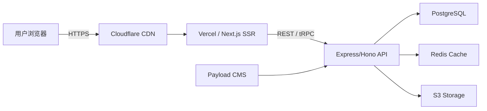

# Skill-Share 架构设计文档

## 1. 项目概述

Skill-Share 是一个技能分享平台（参考 aisupermarket.top），用户可以浏览、搜索和分享各类 AI 技能资源。平台包含技能展示、博客系统、社区互动等核心功能。

## 2. 系统架构总览



系统采用前后端分离架构，分为三个核心层：

| 层级 | 技术栈 | 职责 |
|------|--------|------|
| **Frontend** | Next.js 14 · App Router · TypeScript | 用户界面与交互 |
| **Backend** | Node.js · Express/Hono · TypeScript | 业务逻辑与数据处理 |
| **Infrastructure** | Vercel · Railway/Render · Cloudflare | 部署与运维 |

---

## 3. 前端架构

### 3.1 核心框架
- **Next.js 14** — App Router 模式，支持 SSR / SSG / ISR
- **TypeScript** — 全量类型安全

### 3.2 页面路由
| 路由 | 说明 |
|------|------|
| `/` | 首页 — 技能展示、分类筛选 |
| `/blog` | 博客列表页 |
| `/blog/[slug]` | 博客详情页 |

### 3.3 组件体系
- **Navbar** — 全局导航栏
- **Cards** — 技能卡片 / 博客卡片
- **MDX Renderer** — 博客内容渲染（支持 MDX）

### 3.4 样式方案
- **Tailwind CSS** — 原子化 CSS
- **Shadcn/UI** — 高质量组件库

### 3.5 状态与数据管理
| 工具 | 用途 |
|------|------|
| **TanStack Query** | 服务端数据缓存与同步 |
| **Zustand** | 客户端轻量状态管理 |
| **next-auth** | 用户认证（OAuth / JWT） |
| **next-mdx-remote** | MDX 远程渲染 |

---

## 4. 后端架构

### 4.1 核心框架
- **Node.js** — 运行时环境
- **Express / Hono** — Web 框架（Hono 为轻量高性能备选）
- **TypeScript** — 全量类型安全

### 4.2 API 层
- **REST API** — 标准 RESTful 接口
- **tRPC** — 端到端类型安全 RPC（前后端共享类型）
- **JWT Auth** — Token 鉴权

### 4.3 博客服务
| 模块 | 说明 |
|------|------|
| Posts | 文章 CRUD |
| Tags | 标签管理与筛选 |
| Search | 全文搜索 |
| RSS | RSS 订阅源生成 |

### 4.4 CMS / 管理后台
- **Payload CMS** — Headless CMS，管理博客和技能内容
- **S3 Upload** — 文件上传至 S3 兼容存储

### 4.5 数据库与缓存
| 组件 | 用途 |
|------|------|
| **PostgreSQL** | 主数据库 |
| **Prisma ORM** | 类型安全的数据库操作 |
| **Redis** | 缓存 + API 限流 |

---

## 5. 基础设施与 DevOps

| 服务 | 职责 |
|------|------|
| **Vercel** | 前端部署 + CDN 全球加速 |
| **Railway / Render** | 后端 + 数据库托管 |
| **GitHub Actions** | CI/CD 自动化流水线 |
| **Cloudflare** | DNS 解析 + DDoS 防护 |

---

## 6. 数据流架构



## 7. monorepo 目录结构（规划）

```
skill-share/
├── apps/
│   ├── web/                 # Next.js 前端
│   │   ├── app/             # App Router 页面
│   │   ├── components/      # UI 组件
│   │   ├── lib/             # 工具函数
│   │   └── styles/          # 全局样式
│   └── api/                 # Express/Hono 后端
│       ├── src/
│       │   ├── routes/      # API 路由
│       │   ├── services/    # 业务逻辑
│       │   ├── middleware/  # 中间件
│       │   └── utils/       # 工具函数
│       └── prisma/          # Prisma Schema
├── packages/
│   ├── shared/              # 前后端共享类型与工具
│   ├── ui/                  # 共享 UI 组件库
│   └── config/              # 共享配置
├── turbo.json               # Turborepo 配置
├── package.json
└── docker-compose.yml       # 本地开发环境
```